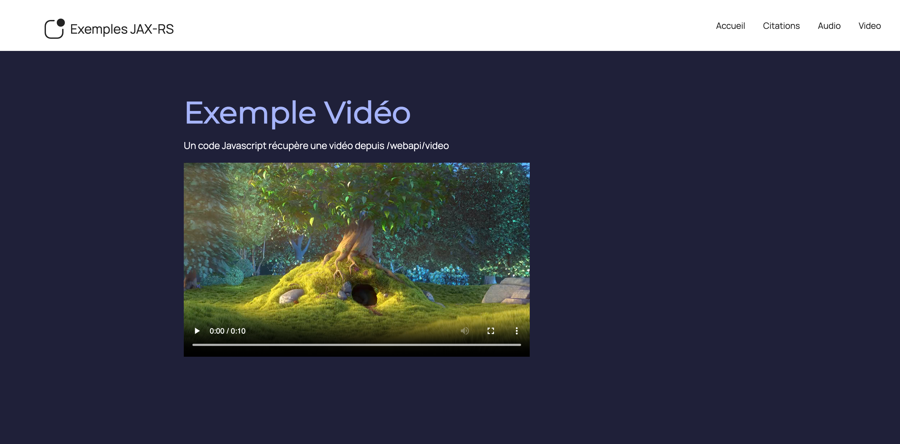

# Projet JAX-RS

Simple projet proposant une API Rest implémentée en Jersey (JAX-RS).
Il est possible de tester l'API via :

- http://localhost:8181/home

# Technologies

- Jakarta EE 9
- JAX-RS (Jersey) 3.1.1

# Aperçus

##### Accueil :

##### Citations :

##### Audio :

##### Video :

